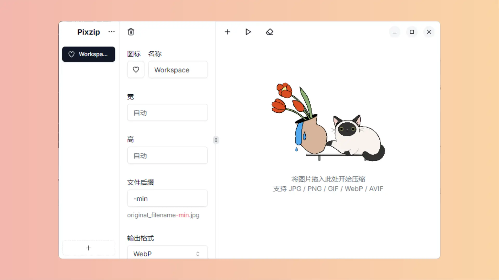

# Pixzip 图片压缩

|      网站      |                             链接                             |
| :------------: | :----------------------------------------------------------: |
|   开源版官网   | <a href="https://xiangsu.fun/" class="to-url" target="_blank">直达链接</a> |
| 开源版`Github` | <a href="https://github.com/richhost/pixzip" class="to-url" target="_blank">直达链接</a> |
|   Pro版官网    | <a href="https://pixzip.cutepuppy.tech" class="to-url" target="_blank">直达链接</a> |

- 支持 `Windows 10+`和`MacOs 11+`
- 提供开源版本。
- 支持 `JPG/PNG/GIF/WebP/AVIF` 格式图片
- 支持批量压缩

> [!NOTE] 个人认为
>
> 开源版足够使用了。如果有更高需求，那么可以选择 `Pro` 版，价格还可以接受

## 开源版

Pixzip 开源版提供一种快速且免费的方式来压缩图片，支持多种图片格式，并保护用户隐私，源代码开放。适用于 macOS 和 Windows 系统。

1. Pixzip 致力于为用户提供高效且无需费用的图片压缩工具，以节省存储空间。
2. 软件支持多种操作系统，确保了广泛的应用范围。
3. Pixzip 提供定制化的压缩选项，允许用户根据需求选择输出大小、格式和压缩强度。
4. Pixzip 强调隐私安全，通过本地处理避免了图片上传，减少了潜在的风险。
5. 无损压缩技术确保了压缩后的图片质量，同时实现了显著的存储空间节省。

## Pro版

需要更高级功能如按比例缩放和暗色模式的用户，可以选择使用 `Pixzip Pro` 版本。

### 定价

## 区别

`Pro`版在开源版本的基础上，除了拥有更舒适的 `ui` 之外，提供了暗色模式，英文适配，图片压缩前后对比，开发者模式。后续还会增添更多功能

