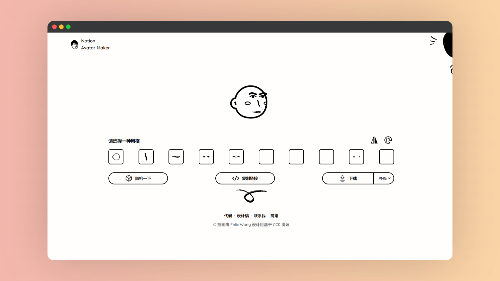

# Notion Avatar Maker

| 网站 |                             链接                             |
| :--: | :----------------------------------------------------------: |
| 官网 | <a href="https://notion-avatar.vercel.app/zh" class="to-url" target="_blank">直达链接</a> |

用于制作风格化的 Notion 风格头像，允许用户通过选择不同的面部特征和配饰来个性化自己的头像。

## 选项

具体组件包括面部轮廓、鼻子、嘴巴、眼睛、眉毛、眼镜、头发、配饰、细节和胡子。每个部分都有多种选项，每个图像代表一个特定的面部特征，用户可以通过点击来选择他们喜欢的风格。所有的图像都采用了响应式设计，以确保在不同设备上的清晰展示。

## 说明

- 用户可以自由地组合不同的元素来创建独一无二的 Notion 风格头像。
- 通过使用 SVG 格式的图像，网页确保了头像的质量在不同尺寸下保持一致，同时也保证了图像加载的效率。
- 网页的设计理念体现了对用户个性化需求的重视，以及对细节的关注，如图像的无损放大和懒加载功能。