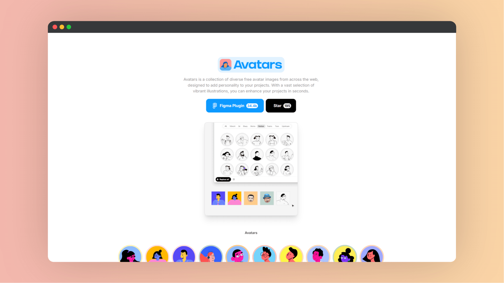

# Avatars

| 网站 |                             链接                             |
| :--: | :----------------------------------------------------------: |
| 官网 | <a href="https://alohe.github.io/avatars/" class="to-url" target="_blank">直达链接</a> |

免费、多样化的头像列表，用于为用户的项目增添个性化元素，头像图片来自 `Craftwork.design` 网站，并且提供了一个 `Figma` 插件，方便用户安装和使用。

## 摘要

提供了一个包含多种免费头像的列表，这些头像旨在为用户的项目增 color。这些图像收集自网络，并且是完全免费且可以从网站上直接下载的。此外，还有一个专门的 Figma 插件，用于帮助设计师和开发者更容易地集成这些头像到他们的项目中。该插件由 Alohe 开发。

## 说明

- **多样性与免费**：网页强调了头像的多样性和免费性，适用于各种项目需求。
- **便捷性**：通过 Figma 插件，用户可以快速、方便地将头像集成到设计中，提高工作效率。
- **使用灵活性**：头像图片可以自由下载和使用，提供了高度的灵活性和自定义选项。