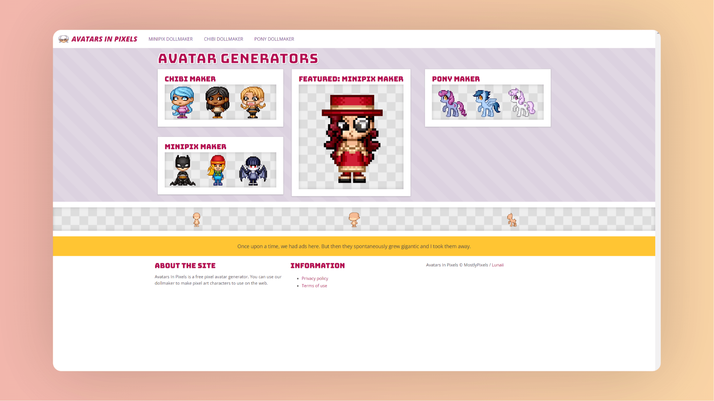

# Avatars In Pixels

| 网站 |                             链接                             |
| :--: | :----------------------------------------------------------: |
| 官网 | <a href="https://www.avatarsinpixels.com/" class="to-url" target="_blank">直达链接</a> |

该网站提供了创建像素风格头像的工具，包括 `Chibi maker` 和 `Minipix maker`，以及一个 `Pony maker`。

## 说明

- **个性化头像创作**：网站强调用户可以通过提供的工具创建个性化的像素风格头像。
- **用户友好**：提供的工具设计简单易用，适合不同用户群体。
- **多样性**：网站提供不同风格的头像生成器，包括 Chibi、Minipix 和 Pony 风格，满足不同用户的需求。
- **特色功能**：Minipix maker 被特别强调，可能是网站的一项独特服务或特色功能。