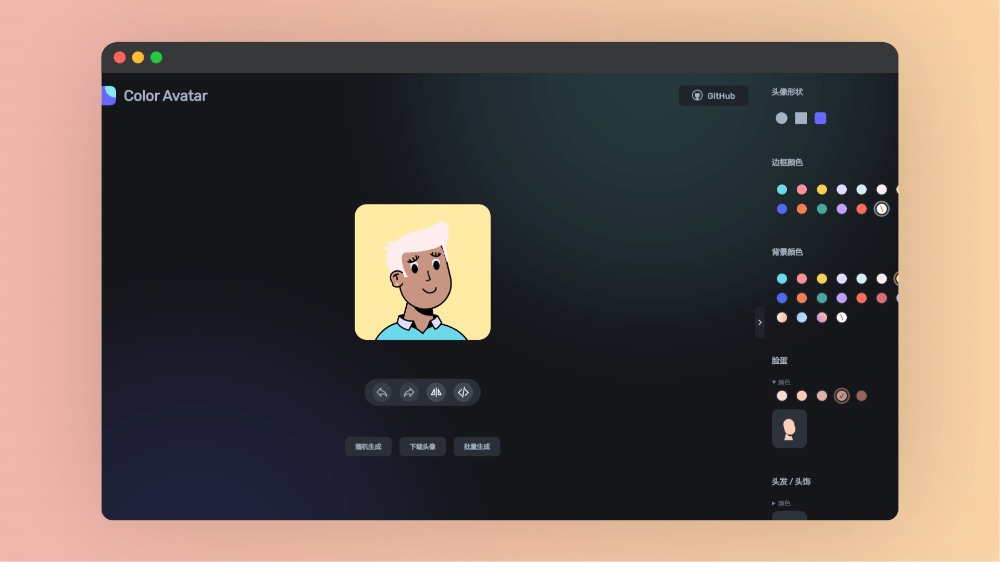

# Color Avatar

| 网站 |                             链接                             |
| :--: | :----------------------------------------------------------: |
| 官网 | <a href="https://vue-color-avatar.leoku.dev/" class="to-url" target="_blank">直达链接</a> |

网站提供了一个基于 Vue 的头像生成器，用户可以通过选择不同的配置选项来设计自己的头像。

## 选项

- **头像形状**
- **边框颜色**
- **背景颜色**
- **面部特征**

## 说明

- 网页的设计理念是提供高度的个性化选项，让用户能够创建一个既独特又具有趣味性的头像。
- 通过提供丰富的颜色和风格选项，用户可以根据自己的喜好和需求，设计出数百万种可能的头像组合。
- 网页的用户界面设计注重用户体验，通过直观的选项和实时预览，简化了头像创建的流程。
- 网页还提供了 GitHub 链接，鼓励开发者参与和改进项目，体现了开源精神。