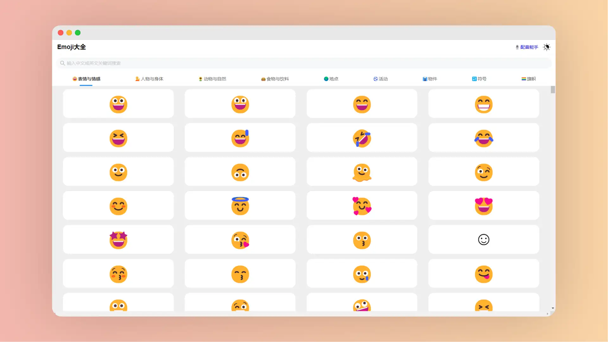

# 轻松找到 emoji

我们在使用 `markdown` 格式的写作过程中时，有时会添加一些个性化的表情符号,以使文章看起来更加生动有趣。而且可以增加文章的可读性和吸引力。

比如：😅 🥰 😬 🐭 🥨 🏸 ...

> [!CAUTION] 提示
>
> 安卓设备和苹果设备显示的`emoji`不同哦，但是表达的意思是相同的。

下面推荐几个可以快速查找 `emoji` 的网站，**均可一键复制粘贴到 markdown 编辑器**（需要编辑器支持）

## 找到你心仪的emoji

<a class="to-url" target="_blank" href="https://emoji.dashgame.com/">直达链接</a>

**特点**

- 支持中/英文搜索
- 支持一键复制

## Emoji表情大全

<a class="to-url" target="_blank" href="https://emoji6.com/emojiall/">直达链接</a>

**特点**

- 支持中/英文搜索
- 分类明确
- 有很大的数量优势
- 支持一键复制

