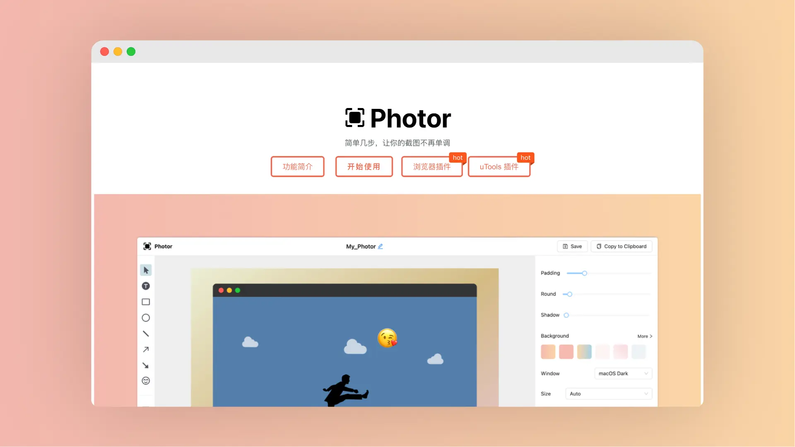

# Photor

Photor 是一个免费且易于使用的在线截图编辑工具，它允许用户快速添加图像、文本、形状和箭头等元素到截图中，以增强截图的表达力和趣味性。

<a class="to-url" href="https://www.photor.fun/" target="_blank">直达链接</a>

## 介绍

用户可以通过它来创建视觉吸引力更强的图像，无需下载或安装任何软件。Photor 支持多种语言，适用于不同背景的用户。

> [!NOTE]
>
> Photor 还支持 浏览器插件、uTools 插件

## 特点

- **简单易用**：该工具提供了直观的界面和工具集，使得用户能够快速上手，无需专业的图像编辑技能。
- **功能多样**：Photor 提供了丰富的编辑功能，包括但不限于添加图像、文本、形状和箭头，以及调整颜色和透明度等。
- **无需安装**：作为一个在线服务，Photor 允许用户在不下载软件的情况下直接在浏览器中进行截图编辑。

