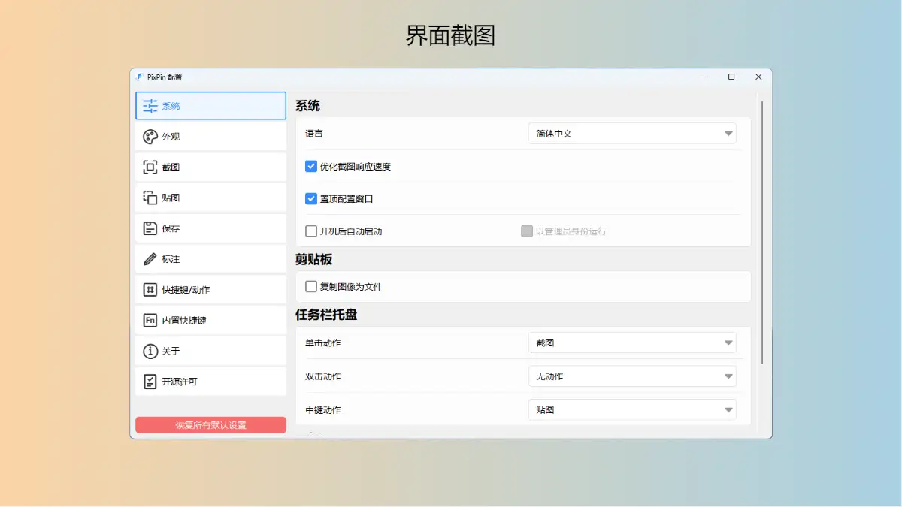

# PixPin

|                网站                |                             链接                             |
| :--------------------------------: | :----------------------------------------------------------: |
|                官网                | <a href="https://pixpinapp.com/" class="to-url" target="_blank">直达链接</a> |
| Windows \| Mac 最新测试版地址 | <a href="https://pixpinapp.com/change-log/1.8.18.html#%E4%B8%8B%E8%BD%BD%E5%9C%B0%E5%9D%80" class="to-url" target="_blank">直达链接</a> |
|              使用文档              | <a href="https://pixpinapp.com/start/what-is-pixpin.html" class="to-url" target="_blank">直达链接</a> |
|              更新日志              | <a href="https://txc.qq.com/products/614512/change-log" class="to-url" target="_blank">直达链接</a> |

一款功能全面且易于使用的截图工具，它不仅能帮助你快速截取所需内容，还提供贴图、标注、文本识别等高级功能。

## 功能

1. **精准截图，随心所欲**

PixPin 的截图功能非常强大，它允许你自由选择截图区域或自动探测窗口，无论是局部细节还是整个屏幕，都能精准截取。

2. **随时贴图，参考无忧**

工作时需要参考的资料太多？PixPin 的贴图功能让你可以将截图“贴”在其他窗口之上，随时查看，无需切换。

3. **丰富标注，表达清晰**

标注功能是 PixPin 的一大亮点，无论是简单的箭头指示还是复杂的图形标注，都能帮助你清晰地表达你的想法。

4. **文本识别，智能高效**

遇到需要提取的文本信息？PixPin 的文本识别功能可以迅速准确地帮你识别图像上的文字，省去手动输入的麻烦。

5. **长截图，视野无限**

屏幕内容太长怎么办？PixPin 的长截图功能通过智能拼接算法，让你能够截取超出屏幕的长图，视野不再受限。

6. **截动图，记录操作**

操作演示需要录制成视频？使用 PixPin 的截动图功能，你可以记录屏幕操作并生成动图，同时使用标注工具，让演示更加生动。

## Pro版

当前（2021-07-19）我没找到在哪里购买，但是作者已经把 Pro 功能给贴出来了，可以在 [PixPin会员](https://pixpinapp.com/start/member-features.html) 查看。