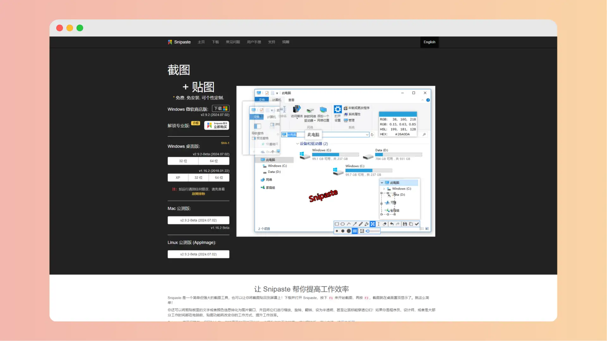
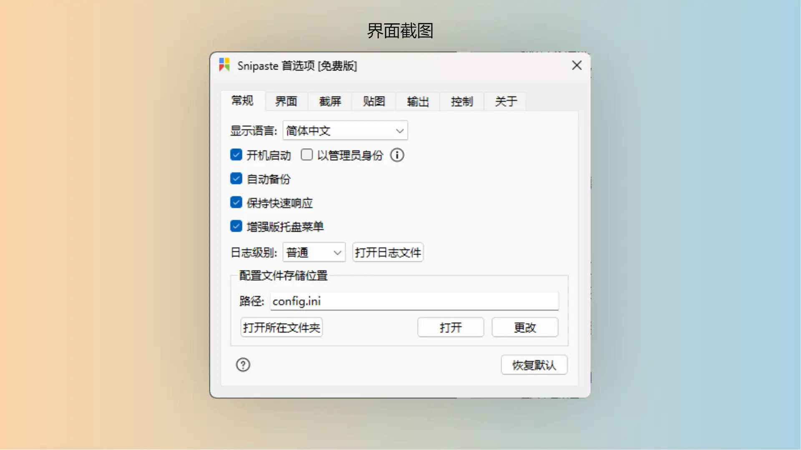

# Snipaste

|       网站        |                             链接                             |
| :---------------: | :----------------------------------------------------------: |
|       官网        | <a href="https://zh.snipaste.com/" class="to-url" target="_blank">直达链接</a> |
|     用户手册      | <a href="https://docs.snipaste.com/zh-cn/" class="to-url" target="_blank">直达链接</a> |
| 专业版/免费版对比 | <a href="https://docs.snipaste.com/zh-cn/pro?id=snipaste-2-%e4%b8%93%e4%b8%9a%e7%89%88%e5%85%8d%e8%b4%b9%e7%89%88-%e5%af%b9%e6%af%94" class="to-url" target="_blank">直达链接</a> |

Snipaste是一款高级截图软件，它支持 `Windows`、`Mac(公测中)` 和 `Linux(公测中)` 操作系统，确保了不同用户的需求得到满足。软件界面简洁，操作便捷，即使是初次使用者也能快速上手。

## 核心功能

- **截图功能**：

    Snipaste 提供了自动检测界面元素区域、像素级鼠标控制等高级截图功能，让截图更加精准。

- **贴图功能**：

    用户可以将截图或其他内容贴在屏幕上，支持缩放、旋转、透明度调整等操作，极大提升了工作的灵活性。

- **安全性**：

    Snipaste 承诺不扫描硬盘、不上传用户数据，保障了用户的隐私安全。

Snipaste 允许用户根据个人喜好调整主题色、界面字体、自定义快捷键等，让工具更加贴合个人的使用习惯。

## 版本限制

[专业版/免费版对比](https://docs.snipaste.com/zh-cn/pro?id=snipaste-2-%e4%b8%93%e4%b8%9a%e7%89%88%e5%85%8d%e8%b4%b9%e7%89%88-%e5%af%b9%e6%af%94)

- Snipaste 2.x 只对**个人用户**免费，公司使用请购买专业版或使用 Snipaste 1.x
- Snipaste 1.x 版将停留在 1.16.2，不再更新
- 从 2.0 开始，Snipaste 免费版将只提供缺陷修复，基本不再提供新功能，后续开发的新功能都只加入到专业版

## 其他推荐

> [!WARNING] 提示
>
> 如果不想付费而且想使用一些高级功能，以下这个软件也可能适合你
>
> *PixPin 还支持录制 `Gif`，长截图等功能*
>
> 但是截至当前 (2024-7-19) ，`Mac` 版还未正式发布
>
> **[PinPix](./PixPin)**

