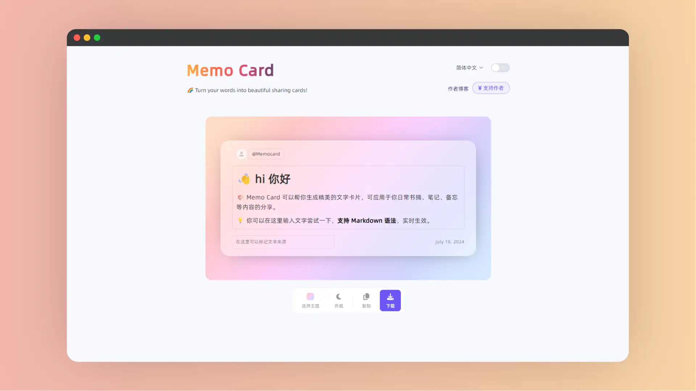

# Memo Card

<a href="https://www.memocard.net/" class="to-url" target="_blank">直达链接</a>

`Memo Card` 是一个能够将文字内容转换成美观分享卡片的在线工具，适用于日常书摘、笔记和备忘录分享。

- 支持切换不同模板
- 支持切换 `Light`和`Dark`
- 支持一键复制
- 支持下载为 `png` 格式图片

> [!INFO] 提示
>
> 如果简单使用，`Memo Card` 基本可以满足需求了。如果需要更多功能，比如：自定义边距什么的，推荐使用 [流光卡片](./流光卡片)

## 介绍

`Memo Card` 是一个能够将文字内容转换成美观分享卡片的创意工具，允许用户将他们的文字内容转换成吸引人的分享卡片。这些卡片可以用于多种场景，如记录书摘、编写笔记或制作备忘录。

用户可以在网站上输入文字并使用 `Markdown` 语法进行格式化，内容实时生效，方便用户预览。此外，用户还可以标记文字来源，确保分享时的版权合规性。网站提供了不同的主题和外观选项，用户可以根据个人喜好选择，并通过复制或下载功能获取最终的卡片。