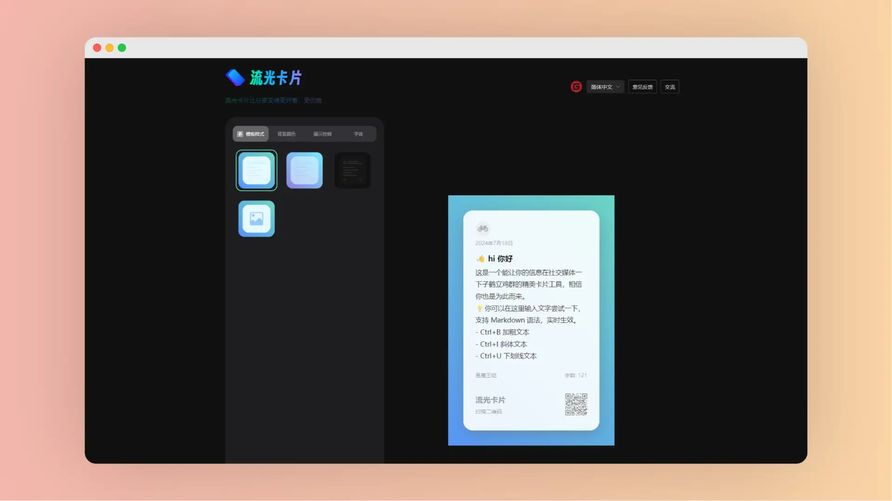

# 流光卡片

|    网站     |                             链接                             |
| :---------: | :----------------------------------------------------------: |
|  官方网站   | <a href="https://www.streamertextcard.com" class="to-url" target="_blank">直达链接</a> |
|  官方文档   | <a href="https://flowus.cn/share/b8f12c14-1042-42f3-8281-6149f20e3e95" class="to-url" target="_blank">直达链接</a> |
| Google 插件 | <a href="https://chromewebstore.google.com/detail/%E6%B5%81%E5%85%89%E5%8D%A1%E7%89%87%E8%AE%A9%E5%88%86%E4%BA%AB%E6%9B%B4%E4%BC%98%E9%9B%85/cpfhabllndoodbfmidhlpafonbfjjigo" class="to-url" target="_blank">直达链接</a> |
| 官方 Github | <a href="https://github.com/ygh3279799773/streamer-card" class="to-url" target="_blank">直达链接</a> |

流光卡片是一个旨在让用户分享信息更加优雅和吸引眼球的文字卡片工具，它支持 `Markdown` 语法，并提供了一些快捷键以便用户快速格式化文本。可用于在社交媒体上分享。

> [!WARNING] 工具比较
>
> **与 [Memo Card](./MemoCard) 相比较**
>
> - 相同点
>     - 支持切换不同模板
>     - 支持切换 `Light`和`Dark` 主题
>     - 支持一键复制
>     - 支持下载为 `png` 格式图片
> - 不同点
>     - 流光卡片支持自定义内边距、宽度等
>     - 流光卡片支持自定义字体
>     - 流光卡片支持更多功能

## 介绍

用户可以通过快捷键快速设置文本的加粗、斜体和下划线格式。网站还提供了一系列的模板样式、背景颜色、展示控制和字体选项，以便用户根据自己的喜好定制卡片。

网站的控制选项还提供了 图标、日期、文字计数、二维码等高级功能供用户自定义设置。

