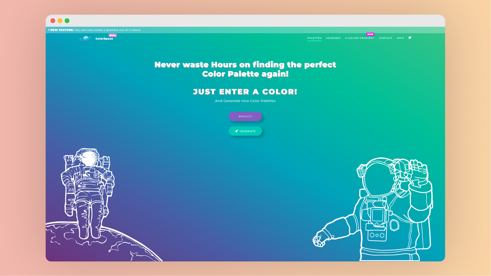

# ColorSpace 配色方案和渐变生成器

| 网站 | 链接 |
| :----: | :----: |
| 官方网站 | <a href="https://mycolor.space/" class="to-url" target="_blank">直达链接</a> |
| 渐变色 | <a href="https://mycolor.space/gradient" class="to-url" target="_blank">直达链接</a> |
| 三色渐变 | <a href="https://mycolor.space/gradient3" class="to-url" target="_blank">直达链接</a> |

在现代设计中，颜色的选择至关重要。ColorSpace 提供了一系列强大的工具，帮助设计师和爱好者轻松创建和调整配色方案。无论您是需要简单的颜色转换，还是复杂的渐变效果，这个平台都能满足您的需求。

### 配色生成器

ColorSpace 的配色方案生成器是一个用户友好的工具，允许用户生成和调整完美的配色方案。只需输入一个初始颜色，工具会自动生成一组和谐的颜色组合。用户还可以手动调整每种颜色，确保最终的配色方案完全符合需求。

### 渐变生成器

对于那些需要创建渐变效果的人来说，ColorSpace 提供了一个功能强大的渐变生成器。用户可以选择两种颜色，创建线性或径向渐变。这个工具提供了实时预览功能，使用户可以在设计过程中立即看到效果。

### 三色渐变生成器

如果您需要更加复杂的渐变效果，ColorSpace 还有一个专门的三色渐变生成器。这个工具允许用户选择和调整三种颜色，创建出独特的渐变效果。无论是背景设计还是按钮样式，这个工具都能帮您实现。

### 网站信息和使用指南

ColorSpace 的“关于”页面详细介绍了网站的功能和使用方法。无论您是初次使用还是经验丰富的设计师，这些信息都能帮助您充分利用平台的各种工具。

通过使用 ColorSpace，您可以轻松创建出色的配色方案和渐变效果，提升您的设计质量。无论是网页设计、平面设计还是其他创意项目，这个平台都能为您提供强大的支持。
