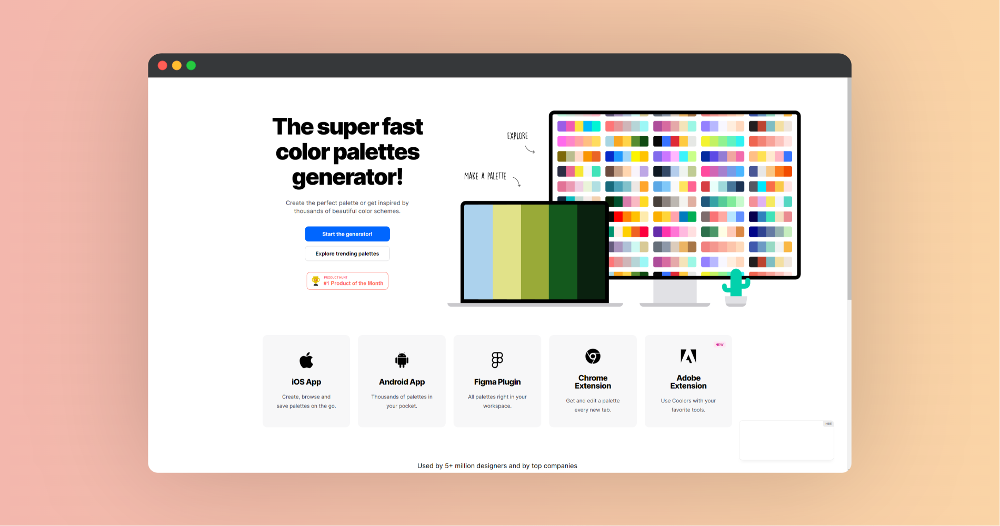

# Coolors 生成与管理您的调色板

|     网站     |                             链接                             |
| :----------: | :----------------------------------------------------------: |
|   官方网站   | <a href="https://coolors.co/?ref=669e2ca282f155000b7bc076" class="to-url" target="_blank">直达链接</a> |
| 图像生成色彩 | <a href="https://coolors.co/image-picker?ref=669e2ca282f155000b7bc076" class="to-url" target="_blank">直达链接</a> |

Coolors 是一款功能强大的在线调色板生成工具，帮助设计师和创意人士轻松创建、调整和管理他们的调色板。无论您是想为新项目选择配色，还是需要查看当前流行的色彩趋势，Coolors 都能满足您的需求。

## 主要功能

- **调色板生成器**：Coolors 提供快速生成调色板的功能，用户只需点击几下即可获得全新的配色方案。无论您是寻找灵感还是有特定需求，Coolors 都能帮助您找到理想的配色。
- **颜色调整工具**：用户可以通过 RGB、CMYK、LAB、HSB 和 Pantone 等不同模式精确调整颜色。这种多样化的调色方式使得 Coolors 成为一个适用于各类设计工作的理想工具。
- **调色板管理与分享**：创建的调色板可以轻松保存到用户的个人库中，方便随时查看和使用。此外，Coolors 还支持调色板的分享功能，让您与团队成员或客户共同讨论和调整配色方案。

## 探索流行调色板

在 Coolors 的 `Trending Palettes` 页面，用户可以浏览当前流行的调色板。每个调色板都包含多个颜色，并附有对应的 HEX 代码，方便用户直接应用到他们的设计中。用户还可以收藏、下载或进一步调整这些调色板，以满足特定项目的需求。

### 开始使用

只需访问 [Coolors 官网](https://coolors.co/?ref=669e2ca282f155000b7bc076) 或者直接进入 [热门调色板页面](https://coolors.co/palettes/trending?ref=669e2ca282f155000b7bc076)，即刻开始探索和创建您自己的调色板。通过 Coolors，您的设计工作将更加轻松和高效。
