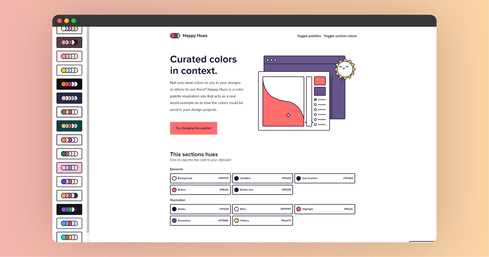

# HappyHues 提供的调色板

|   网站   |                             链接                             |
| :------: | :----------------------------------------------------------: |
| 官方网站 | <a href="https://www.happyhues.co" class="to-url" target="_blank">直达链接</a> |

Happy Hues 是一个设计灵感网站，专注于提供各种颜色调色板，并展示这些调色板在真实设计项目中的应用。无论你是经验丰富的设计师还是刚入门的新手，Happy Hues 都能帮助你轻松找到合适的颜色组合。

## 如何使用 HappyHues？

1. **选择调色板**：浏览网站上的多种颜色调色板，选择适合你的项目需求的颜色组合。
2. **复制颜色代码**：通过点击颜色，可以轻松复制十六进制代码，便于在设计软件中使用。
3. **查看实际应用**：每个调色板都配有使用实例，展示了如何在设计中应用这些颜色。

## 了解颜色术语

在设计过程中，理解颜色术语至关重要：

- **色调（Hue）**：基色，没有添加任何白色（色调）或黑色（阴影）。
- **色调（Tint）**：将白色添加到色调中，降低饱和度。
- **阴影（Shade）**：将黑色添加到色调中，降低亮度。
- **调子（Tone）**：在色调中添加灰色（白色+黑色），介于色调和阴影之间。
- **亮度（Value）**：衡量色调的亮度，即颜色的明暗程度。
- **饱和度（Saturation）**：颜色的纯度，高饱和度意味着颜色鲜艳，低饱和度则颜色偏暗淡。

## 颜色心理学

每种颜色都会传达不同的情感和意义。了解这些可以帮助你在设计中做出更明智的颜色选择：

- **红色**：力量、激情、危险；通常用于快餐品牌以吸引注意力。
- **黄色**：阳光、快乐、警告；用于引起注意但也可能引发焦虑。
- **蓝色**：平静、信任、悲伤；常用于社交媒体和科技公司。
- **绿色**：自然、健康、安全；适合环保和健康相关品牌。
- **橙色**：友好、能量、冒险；用于提示行动和户外活动。
- **紫色**：奢华、神秘、精神；用于高端品牌和创意设计。
- **白色**：纯净、简单、空白；适合作为背景色。
- **黑色**：力量、优雅、恐惧；适合添加对比和高端设计。

## 创始人介绍

HappyHues 的创始人 [Mackenzie Child](https://www.mackenziechild.me/) 致力于创建有趣且实用的项目，旨在为设计师提供颜色灵感，并帮助他们理解如何在设计中有效应用这些颜色。

